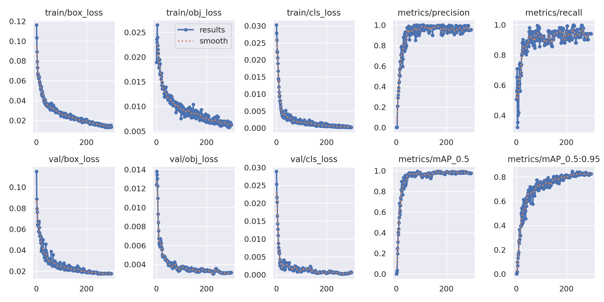
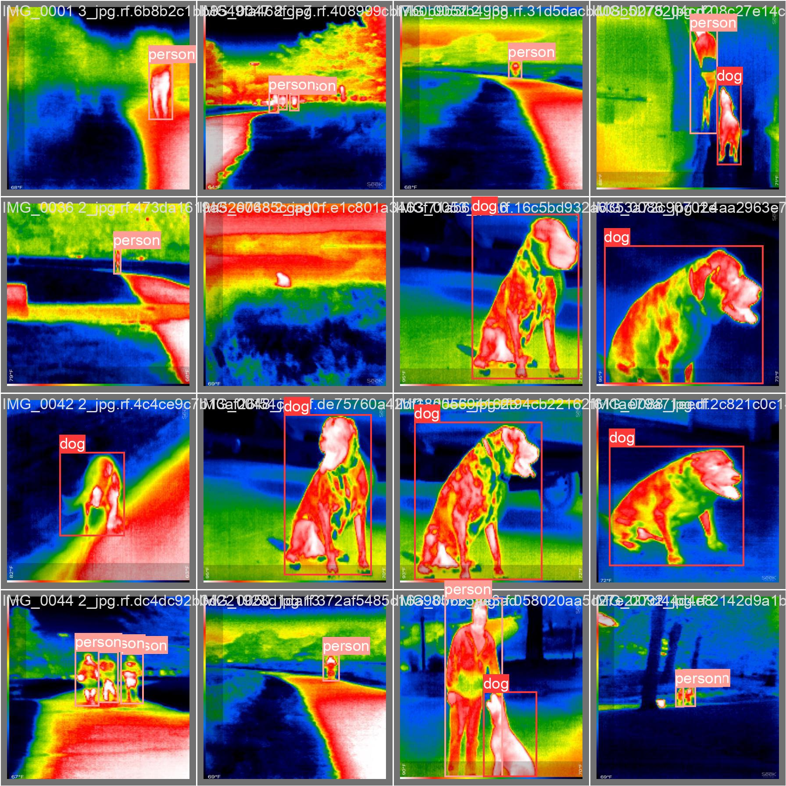
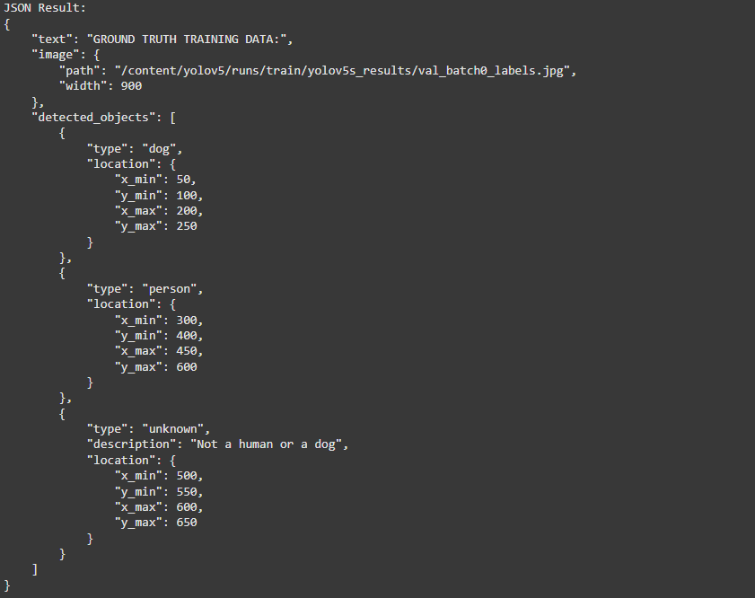
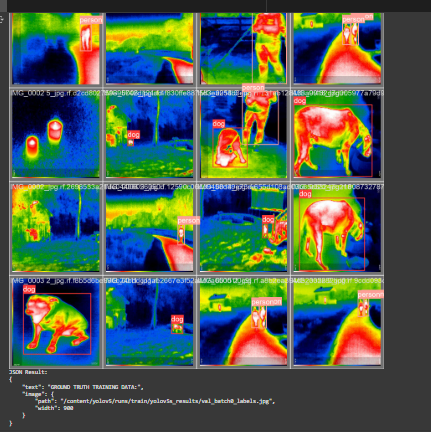

# Object Detection using YOLOv5

## Table of Contents

1. [Introduction](#introduction)
2. [Features](#features)
3. [Requirements](#requirements)
4. [Installation](#installation)
5. [Dataset Preparation](#dataset-preparation)
6. [Training](#training)
7. [Inference](#inference)
8. [Evaluation](#evaluation)
9. [Customization](#customization)
10. [Troubleshooting](#troubleshooting)
11. [References](#references)
12. [Checkout My Colab Link](#checkout-my-colab-link)

---

## Problem Statement
The UI end takes the image input from the user. The AI backend utilizes a lightweight open-source model to perform object detection and returns the results in a structured JSON format. The two components communicate seamlessly to provide a comprehensive solution to the user.

## Introduction

This project implements object detection using YOLOv5, a state-of-the-art real-time object detection model. YOLOv5 is lightweight, fast, and highly accurate, making it suitable for a variety of tasks including autonomous driving, security surveillance, and retail analytics.

## Features

- Real-time object detection
- Pre-trained and custom model support
- Easy-to-use training pipeline
- Flexible data augmentation
- High performance on low-resource hardware

## Requirements

Ensure the following dependencies are installed:

- Python >= 3.7
- PyTorch >= 1.7
- CUDA (for GPU support)
- Other libraries specified in `requirements.txt`

## Installation

1. Clone the repository:

   ```bash
   git clone https://github.com/your-repo/yolov5-object-detection.git
   cd yolov5-object-detection
   ```

2. Install dependencies:

   ```bash
   pip install -r requirements.txt
   ```

3. Verify installation:

   ```bash
   python detect.py --source data/images --weights yolov5s.pt
   ```

## Dataset Preparation

YOLOv5 expects datasets in the following format:

1. Images: Organize images under a `images/` folder.
2. Labels: Corresponding annotations (in YOLO format) should be placed under a `labels/` folder.
3. Dataset structure:
   ```
   dataset/
   ├── train/
   │   ├── images/
   │   └── text/
   ├── test/
   │   ├── images/
   │   └── text/
   ├── val/
   │   ├── images/
   │   └── text/
   ```

Update the `data.yaml` file to specify dataset paths and class names.

## Training

To train a custom model, run:

```bash
python train.py --img 640 --batch 16 --epochs 50 --data data.yaml --weights yolov5s.pt
```

### Key Arguments

- `--img`: Image size (default: 480).
- `--batch`: Batch size (default: 16).
- `--epochs`: Number of training epochs (300).
- `--data`: Path to the dataset configuration file.
- `--weights`: Path to pre-trained weights or specify `yolov5s.pt` for default.

## Inference

Run inference on images or video files:

```bash
python detect.py --source data/images --weights runs/train/exp/weights/best.pt --conf 0.4
```

### Key Arguments

- `--source`: Path to the input (image/video folder or webcam).
- `--weights`: Path to trained weights.
- `--conf`: Confidence threshold (default: 0.4).

### Example Output
After running inference, the results will be saved in the `runs/detect/` folder. You can view the predicted bounding boxes and class labels on the output images. Below is an example of a prediction image:








## Evaluation

Evaluate model performance using metrics like mAP (mean Average Precision):

```bash
python val.py --data data.yaml --weights runs/train/exp/weights/best.pt
```

## Customization

### Modify Model Architecture

Edit the model configuration in the `models/` folder to customize the YOLOv5 architecture.

## Troubleshooting

- **Out of memory (OOM) error**: Reduce batch size using `--batch`.
- **Slow training**: Verify GPU usage and install the latest CUDA drivers.
- **Incorrect detections**: Check dataset annotations and re-train the model with proper configurations.

## References

- [YOLOv5 Repository](https://github.com/ultralytics/yolov5)
- [PyTorch Documentation](https://pytorch.org/docs/)
- [COCO Dataset](https://cocodataset.org/)

## Checkout My Colab Link

To try out the YOLOv5 object detection process in Google Colab with pre-configured setups, click the link below:

[**Try YOLOv5 on Colab**](https://colab.research.google.com/drive/1M4tIX9ItEkrw4bHeuqoEGX6iGrYdMKy6#scrollTo=PF9MLHDb7tB6)

This will open a Colab notebook where you can easily upload your dataset, train a custom model, and run inference with minimal setup.
